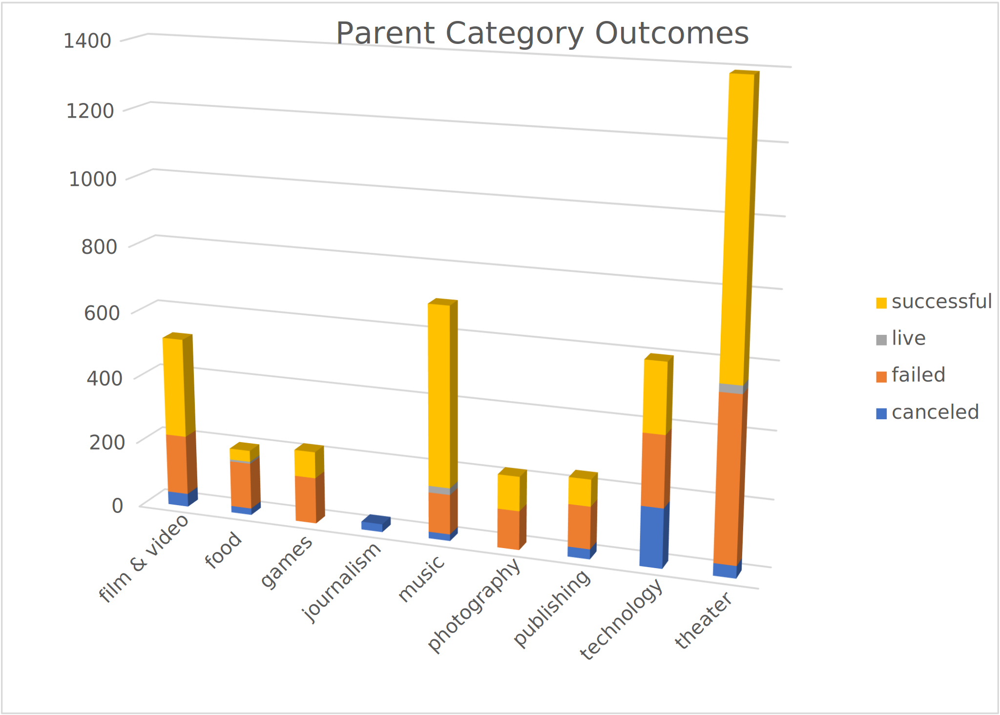
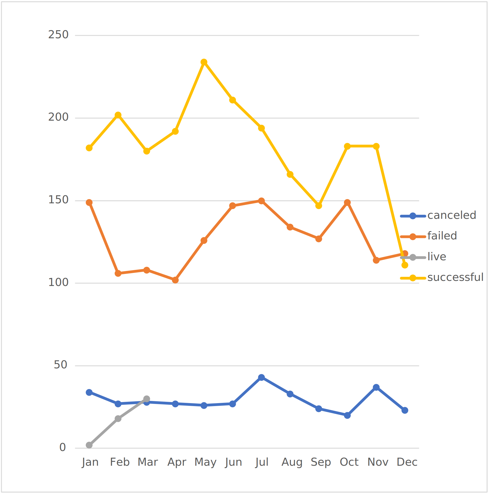
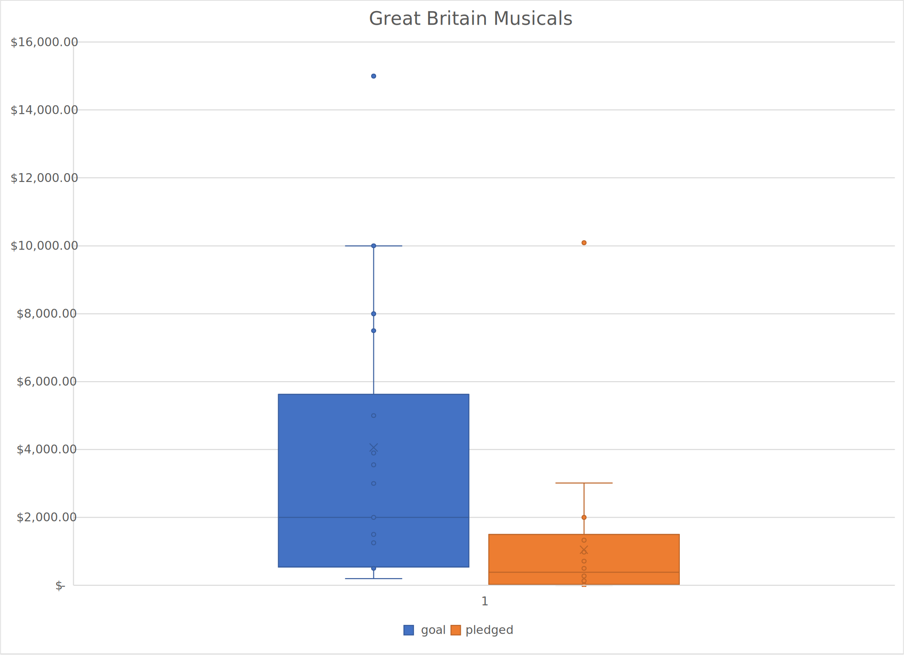

# An Analysis of Kickstarter Campaigns
Performed analysis on several thousand crowdfunding projects to uncover trends with visualizations and statistical computations. 

The line chart above shows that the month that launched the most successful Kickstarter campaigns was May. However, January, June, July, and October all had rougly the same amount of failed campaigns launched. By filtering the data and the charts, I found that overall, theater is a very successful type of campaign with a spike beginning in June that seems to taper off by the end of the year.

After analyzing the failed and successful Kickstartes in the U.S., I found that failed Kickstarters had much higher campaign goals than successful Kickstarters. I recommend an asking price around the average successful Kickstarter goal of $5,049.

After analyzing Great Britain Musicals, looking at the boxplots for the goals and amounts pledged, the mean campagin goal was around 4,000 pounds. Since this is outside of the range of the outliers for the amount pledged, I would recommend trying to a your play produced for less than 4,000 pounds to avoid a failed outcome.

# Kickstarting with Excel

## Overview of Project
Performed analysis on different campaigns to uncover trends in outcomes based on their launch dates and funding goals. 

## Analysis and Challenges

### Analysis of Outcomes Based on Launch Date

I created a pivot table to analyze campaign outcomes based on the launch date of the campaign. I filtered by years and the theater category to get the relevant campaigns. From this pivot table, I created a line chart to show the relationship between campaign outcomes and launch date. 

### Analysis of Outcomes Based on Goal

I created a new sheet to analyze play outcomes based on the funding goal amount by percentages with a table and a line chart. I created a “Goal” column to have various dollar-amount ranges so I could group projects based on their funding goals. I calculated the number of successful, failed, canceled, and total projects by the goal ranges and then found the percentages of each outcome. I created a line chart to visualize this relationship.  

### Challenges and Difficulties Encountered
I didn’t encounter any difficulties throughout this analysis, but I believe that one possible challenge for the analysis of outcomes based on goal could be calculating the percentages correctly for each funding goal range. If you mess up one row, it would have an impact on the rest of the rows and the line chart, which would lead to a false analysis. A possible challenge for the analysis on outcomes based on the launch date could be creating the conversion column incorrectly. This would lead to a problem on the filter of the pivot table, and thus the line chart and analysis. 

## Results

The highest counts of successful campaigns happened during the months of May and June, with 11 more successful campaigns in May. The highest counts of failed campaigns happened in May, July, and October. As you can see, the month of May had the highest counts of both successful and failed campaigns. 

The highest percentage of failed campaigns (100%) were those with goals ranging from $45,000 to $49,999. About 73%-80% of campaigns with goals of about $25,000 to $35,000 also failed. The highest percentage of successful campaigns (about 73%-76%) had a fundraising goal between  <$1,000-$4,999. I found that 67% of campaigns with a fundraising goal between $35,000 - $44,999 were also successful. 

Some limitations of this dataset are the following: the size of the dataset, the data was collected only over 8 years, and that we aren’t given the sizes of the campaigns (staff). 

We could create a pivot table filtered by parent category (theater) and have the outcomes be the rows and the count of backers as the columns. Then we could create a bar graph to visualize the number of backers for each campaign outcome. We could create another pivot table filtered by parent category (theater) with the outcomes as the columns and years as the rows. We could then create a line chart to visualize the relationship between outcomes and year and see if it is significant.   

